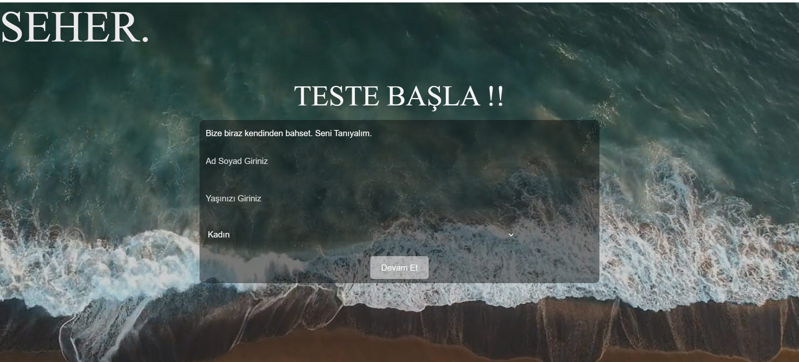

# JavaScript Quiz Uygulaması

Bu proje, HTML, CSS ve JavaScript kullanılarak geliştirilmiş interaktif bir quiz uygulamasıdır. Uygulama kullanıcılardan önce kişisel bilgilerini alır daha sonra soruları ekrana getirir ve devam et butonuna tıklayarak yeni soruyu ekranda gösterir.



## Nasıl Çalıştırılır
```bash
1. Depoyu klonlayın: 
git clone https://github.com/kullaniciadi/quiz-uygulamasi.git

2. Proje klasörüne gidin:
cd quiz-uygulamasi

3. index.html dosyasını bir web tarayıcısında açın.

## Kullanım

İlk olarak kullanıcı bilgilerini (isim, soyisim, yaş, cinsiyet) girin.
Devam Et butonuna tıklayarak quiz sorularını görmeye başlayın.
Her soruyu cevapladıktan sonra Devam Et butonuna tıklayarak bir sonraki soruya geçin.

## Dosya Yapısı
index.html: Ana HTML dosyası.
style.css: CSS dosyası.
index.js: JavaScript dosyası (quiz uygulamasının iş mantığı burada).
assets/: Kullanılan görsel/video klasörü.

## Teknolojiler
HTML
CSS
JavaScript
